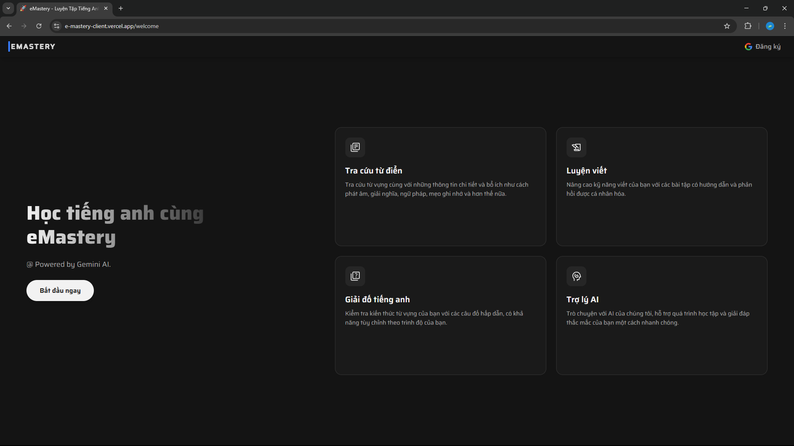
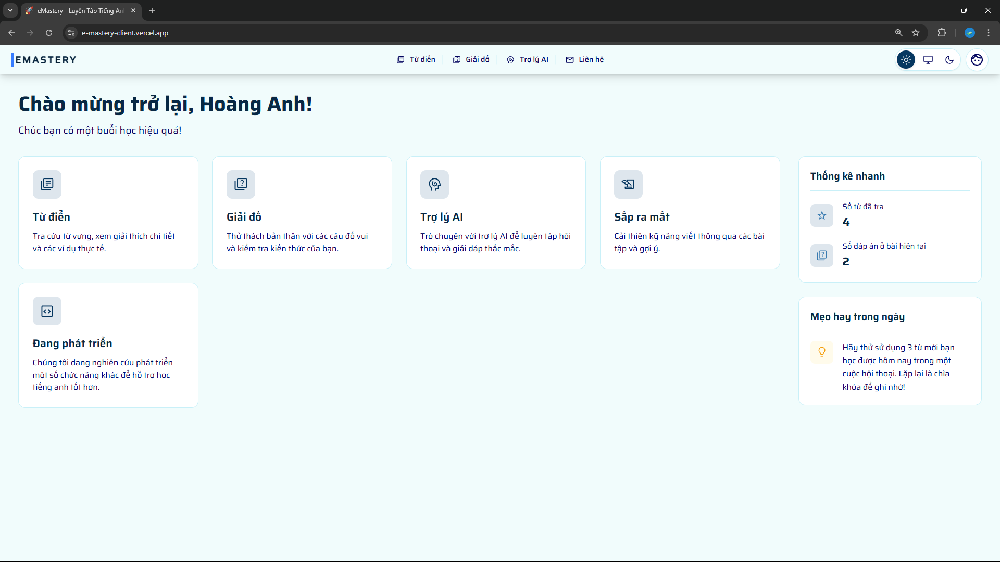
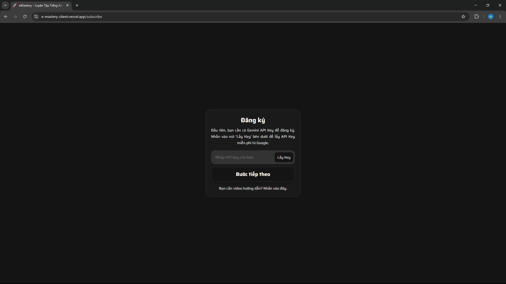
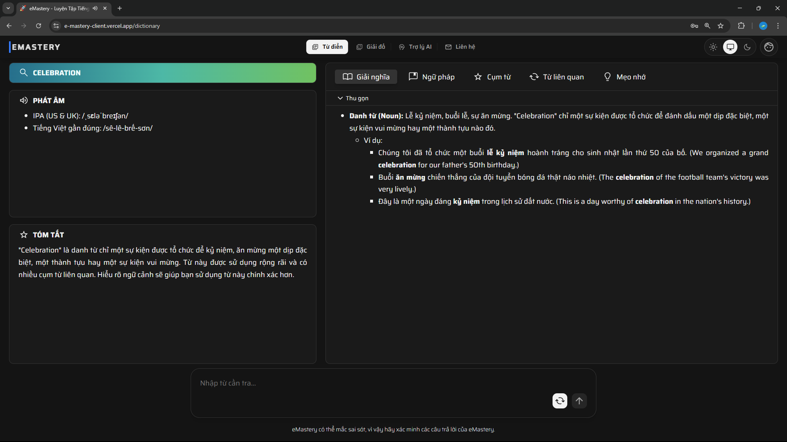
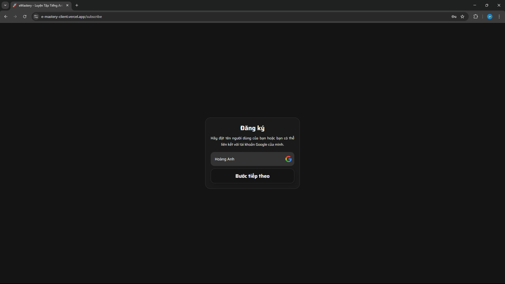
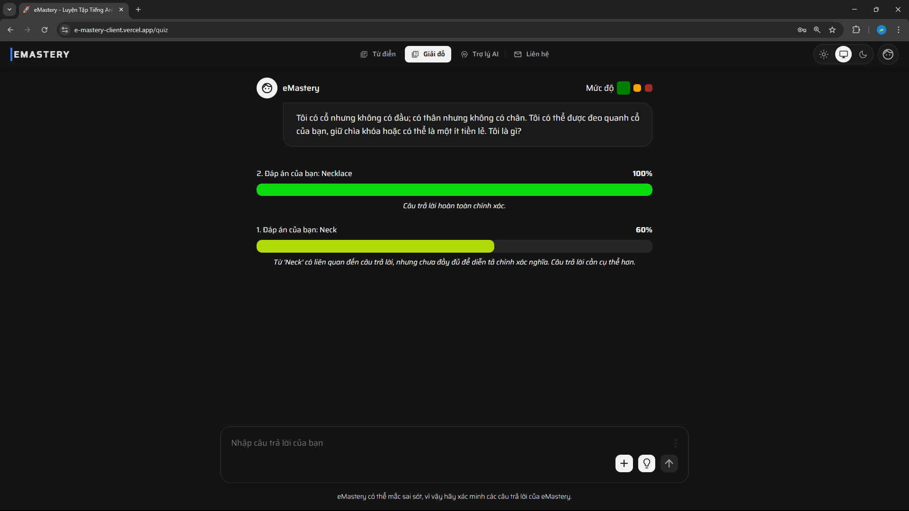
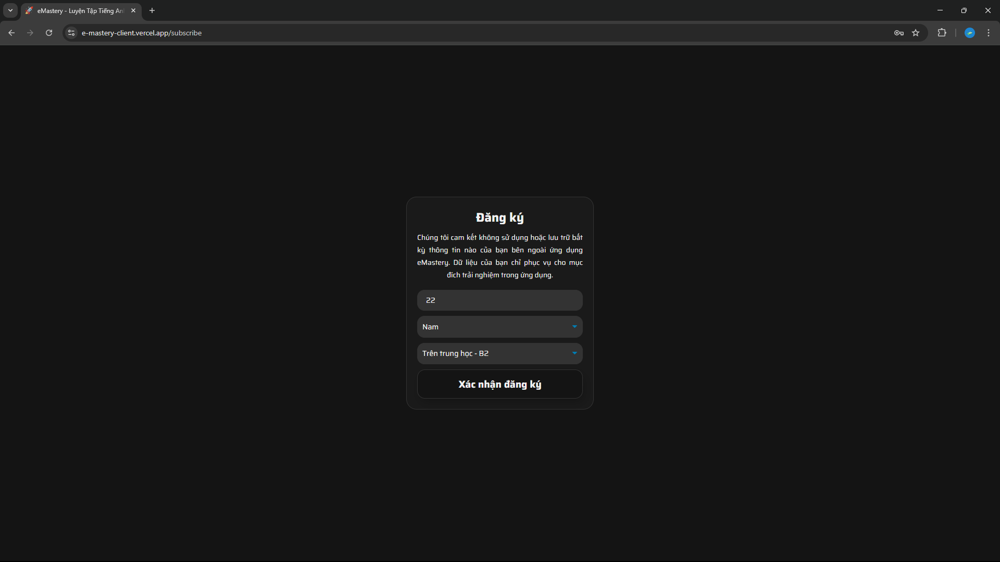
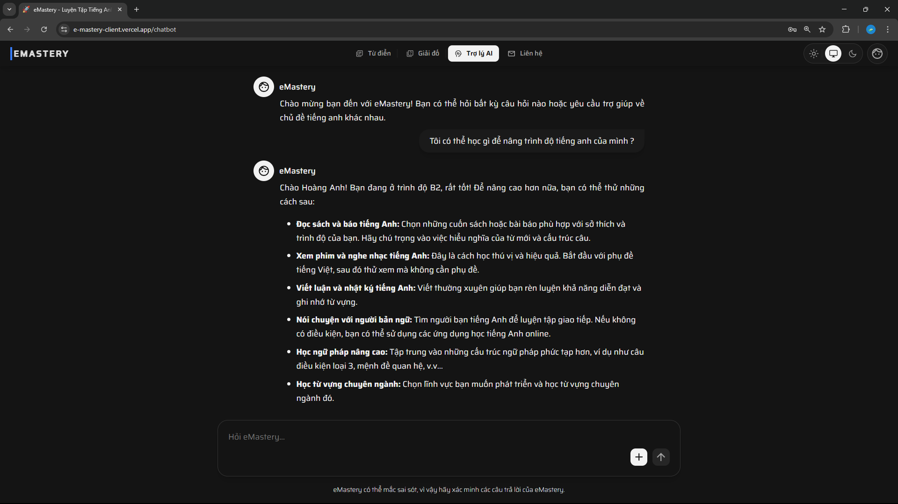

# eMastery - English Learning Support Application (Powered by Gemini AI)

 eMastery is a web application powered by **Gemini AI**, offering a smart and modern learning experience. The application helps users improve their language skills through unique learning tools.

 ## Main Features

 * **Chatbot:** Communicate and practice English with an AI that provides intelligent answers and assistance for English learning.
 * **English-Vietnamese Dictionary:** Look up vocabulary, view detailed explanations, phonetics, and listen to pronunciations.
 * **Quizzes:** Generate vocabulary quizzes based on the user's selected proficiency and level.
 * **Multi-language:** The interface supports both Vietnamese and English.
 * **Theme Customization:** Allows users to switch between Light and Dark themes.
 * **Contact:** A contact form for users to send feedback or request support.

 ## Interface

 | **Welcome & Onboarding Screens** | **Main Interface** |
 | :---: | :---: |
 |  |  |
 | *Welcome Page* | *Homepage* |
 |  |  |
 | *Step 1: Enter API Key* | *Dictionary Page* |
 |  |  |
 | *Step 2: Enter Your Name* | *Quiz Page* |
 |  |  |
 | *Step 3: Enter Other Information* | *Chatbot Page* |

 ## Technologies Used

 ### **Frontend (User Interface)**
 * **Framework:** [ReactJS](https://reactjs.org/) (using [Vite](https://vitejs.dev/))
 * **Language:** [TypeScript](https://www.typescriptlang.org/)
 * **State Management:** React Hooks & Context API
 * **Routing:** [React Router](https://reactrouter.com/)
 * **Styling:** Pure CSS3
 * **Multi-language:** [i18next](https://www.i18next.com/)

 ### **Backend (Server)**
 * **Framework:** [.NET 8](https://dotnet.microsoft.com/)
 * **Language:** C#
 * **API:** RESTful API

 ## Team Members

 | Member Name | Main Role |
 | :--- | :--- |
 | [Hoang Anh](https://github.com/HoaqAnh) | UI/UX Design, Frontend Development. |
 | [Thang Nguyen](https://github.com/imthq1) | Backend Development, AI Model Fine-Tuning. |
 | [Nguyen Duc Thien](https://github.com/nguyenducthienlq1) | Backend Development, AI Model Fine-Tuning. |
 | [Lee Hovng G.Dai](https://github.com/PeterHovng) | Contributor |

 ## License

 This project is licensed under the **MIT License**. See the [LICENSE](LICENSE) file for details.
